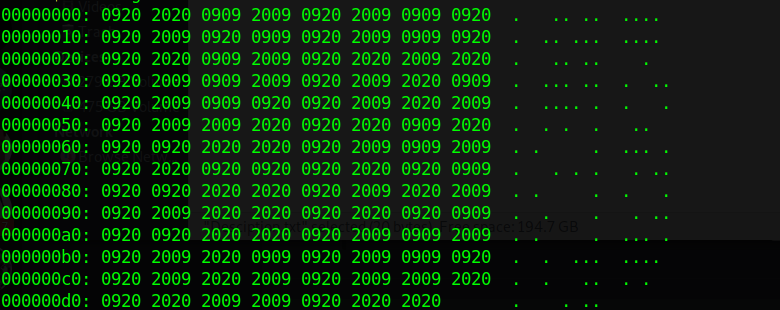

# Blanks

Description: Maybe it's not blank

## Walkthrough

The first thing i did was printing the flag.txt content using strings.
They didn't lie, it was blank.

So I tried to dump the hex content using
```bash
xxd flag.txt
```
output 

<p align="center">

</p>


I started looking at it and trying to find a pattern or something till my eyes met those points and spaces 

I copied them carefully to a python script and i remplaced spaces with 1 and points with 0.

```python

ch=".   .. ..  .... .  .. ...  .... .   .. ..    .  .  ... ..  .  ...  .... .  .   ..  . .  .   ..  . .     .  ... ..   . . .   . ... .     .  .   ..  .    .   . ... .     .  ... ..  .  ...  .... .  .   ..  . .  .    . .."
bi=""
for i in ch:
    if i==" ":
        bi+="1"
    else:
        bi+="0"
print(bi)
```

Output

```bash
0111001001100001011001000110000101110010011110110110001001101100011000010110111001101011011100110101111101100010011101010111010001011111011011100110111101110100010111110110001001101100011000010110111001101011011110100
```
I then used an online tool to convert from binary to ascii

## Flag 
radar{blanks_but_not_blankz}
